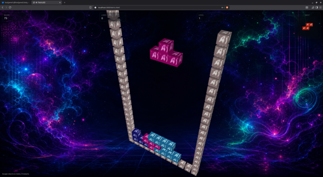

# Tetris3D

Tetris3D is a WebGL Tetris game with 3D rotation, touch controls, and a mobile-friendly layout.



## Overview

This directory contains a self-contained browser game built around a single entry point:

- `tetris.html` - the game page and all runtime logic
- `data/` - textures, shaders, audio, and screen artwork used by the game
- `screenshot.png` - preview image used for this README and social metadata

The game uses a stylized 3D playfield, animated screens for intro/menu/high scores/credits, and local high score storage in the browser.

## Run It

Open `tetris.html` in a modern browser with WebGL enabled.

Example:

```bash
xdg-open tetris.html
```

If you prefer, you can also serve the directory with any static file server and visit the page in your browser.

## Controls

Keyboard:

- `ArrowLeft` / `ArrowRight` - move the piece
- `ArrowDown` - soft drop
- `ArrowUp` - rotate
- `Z` - hard drop
- `R` - restart the intro sequence
- `Escape` - return to the menu

Touch:

- Drag to move pieces
- Tap to rotate
- Two-finger gestures rotate and adjust the 3D camera

## Notes

- High scores are stored in `localStorage` under the browser profile.
- The game is designed to work on both desktop and mobile screens.
- Social preview metadata in `tetris.html` already points at `screenshot.png`.
